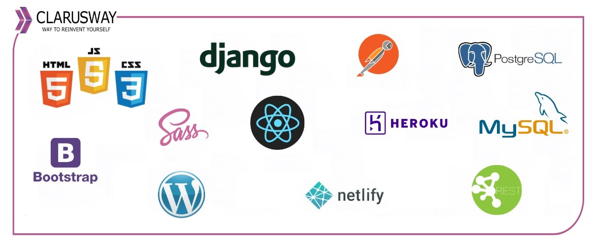

<center></center>
<br>

<center><h1> Django Class Notes</h1></center>
<p>Clarusway</p>
<br>


# Class Based Views

### Nice to have VSCode Extentions:
- Djaneiro - Django Snippets

### Needs
- Python, add the path environment variable
- pip
- virtualenv
- .gitignore file

## Summary
- Introduction to class-based views
- Spin up the project
- Secure your project


## Introduction to class-based views

A view is a callable which takes a request and returns a response. This can be more than just a function, and Django provides an example of some classes which can be used as views. 

These allow you to structure your views and reuse code by harnessing inheritance and mixins. 

Class-based views provide an alternative way to implement views as Python objects instead of functions. They do not replace function-based views, but have certain differences and advantages when compared to function-based views:

- Organization of code related to specific HTTP methods (GET, POST, etc.) can be addressed by separate methods instead of conditional branching.

- Object oriented techniques such as mixins (multiple inheritance) can be used to factor code into reusable components.


## Spin up the project

- Clone the template project to your local:
```git
git clone xxxxxxxxxx
```

- Use the folder created after clone as the procject main directory, cd to this new directory.

- Create virtual environment as a best practice:
```py
python3 -m venv env # for Windows or
python -m venv env # for Windows
virtualenv env # for Mac/Linux or;
virtualenv env -p python3 # for Mac/Linux
```
- Activate scripts:
```bash
.\env\Scripts\activate  # for Windows
source env/bin/activate  # for MAC/Linux
```

- See the (env) sign before your command prompt.

- Install dependencies:
```py
pip install -r requirements.txt
```

- See installed packages:
```sh
pip freeze

# you will see:
asgiref==3.5.0
Django==4.0.1
django-crispy-forms==1.14.0
Pillow==9.0.0
python-decouple==3.5
sqlparse==0.4.2
tzdata==2021.5

# If you see lots of things here, that means there is a problem with your virtual env activation. 
# Activate scripts again
```

- Migrate:
```bash
python3 manage.py migrate  # or;
python manage.py migrate  # or;
py manage.py migrate
```

- Create superuser:
```bash
py manage.py createsuperuser  # or;
python manage.py createsuperuser  # or;
python3 manage.py createsuperuser
```

## Secure your project

### .gitignore

Add standard .gitignore file to the project root directory. 

Do that before adding your files to staging area, else you will need extra work to unstage files to be able to ignore them.

### python-decouple

- Create .env file on root directory. We will collect our variables in this file.
```py
SECRET_KEY = o5o9...
```

- From now on you can send you project to the github, but double check that you added a .gitignore file which has .env on it.


- Run the server and see the initial setup:
```bash
py manage.py runserver  # or;
python manage.py runserver  # or;
python3 manage.py runserver
```

# INCLASS STARTS

## gitignore

add a gitignore file at same level as env folder, and check that it includes .env and /env lines

## Python Decouple

create a new file and name as .env at same level as env folder

copy your SECRET_KEY from settings.py into this .env file. Don't forget to remove quotation marks from SECRET_KEY

```
SECRET_KEY = django-insecure-)=b-%-w+0_^slb(exmy*mfiaj&wz6_fb4m&s=az-zs!#1^ui7j
```

go to settings.py, make amendments below

```python
from decouple import config

SECRET_KEY = config('SECRET_KEY')
```

## Class Based Views

Navigate to https://docs.djangoproject.com/en/3.2/topics/class-based-views/
Explain Documentation

## TemplateView

### Using TemplateView directly in urls.py

go to fscohort/urls.py and amend lines

```python
from django.urls import path
from .views import home,student_list, student_add, student_detail, student_update,student_delete

from django.views.generic import TemplateView # new line

urlpatterns = [
    # path('', home, name="home"), # comment out this line
    # rendering template in urls.py
    path('', TemplateView.as_view(template_name= "fscohort/home.html"), name="home"), # new line

    path('student_list/', student_list, name="list"),
    path('student_add/', student_add, name="add"),
    path('detail/<int:id>/', student_detail, name="detail"),
    path('update/<int:id>/', student_update, name="update"),
    path('delete/<int:id>/', student_delete, name="delete"),
]
```

### Using TemplateView in views.py

go to fscohort/views.py and add below lines

```python
from django.views.generic import TemplateView

class HomeView(TemplateView):
    template_name = "fscohort/home.html"
```

go to fscohort/urls.py and amend lines

```python
from django.urls import path
from .views import home,student_list, student_add, student_detail, student_update,student_delete
# from django.views.generic import TemplateView # commented
from .views import HomeView # new line

urlpatterns = [
    # path('', home, name="home"),
    # path('', TemplateView.as_view(template_name= "fscohort/home.html"), name="home"), # commented
    path('', HomeView.as_view(), name="home"), # new line
    path('student_list/', student_list, name="list"),
    path('student_add/', student_add, name="add"),
    path('detail/<int:id>/', student_detail, name="detail"),
    path('update/<int:id>/', student_update, name="update"),
    path('delete/<int:id>/', student_delete, name="delete"),
]
```

## ListView

navigate to https://docs.djangoproject.com/en/3.2/ref/class-based-views/generic-display/#listview

go to fscohort/views.py and add below lines

```python
from django.views.generic import ListView
class StudentListView(ListView):
    model = Student
    # default template name : # app/modelname_list.html
    # this fits our template name no need to use this time
    # template_name = "fscohort/student_list.html"
    context_object_name = 'students' # default context name : object_list
    paginate_by = 10
```

go to fscohort/urls.py and amend lines

```python
from django.urls import path
from .views import home,student_list, student_add, student_detail, student_update,student_delete
# from django.views.generic import TemplateView
from .views import HomeView, StudentListView # newly added

urlpatterns = [
    # path('', home, name="home"),
    # path('', TemplateView.as_view(template_name= "fscohort/home.html"), name="home"),
    path('', HomeView.as_view(), name="home"),
    # path('student_list/', student_list, name="list"), # commented
    path('student_list/', StudentListView.as_view(), name="list"), # new line
    path('student_add/', student_add, name="add"),
    path('detail/<int:id>/', student_detail, name="detail"),
    path('update/<int:id>/', student_update, name="update"),
    path('delete/<int:id>/', student_delete, name="delete"),
]
```

## DetailView

go to fscohort/views.py and add below lines

```python
from django.views.generic import DetailView
class StudentDetailView(DetailView):
    model = Student
    pk_url_kwarg = 'id'
```

go to fscohort/urls.py and amend lines

```python
from django.urls import path
from .views import home,student_list, student_add, student_detail, student_update,student_delete
# from django.views.generic import TemplateView
from .views import HomeView, StudentListView, StudentDetailView # newly added

urlpatterns = [
    # path('', home, name="home"),
    # path('', TemplateView.as_view(template_name= "fscohort/home.html"), name="home"),
    path('', HomeView.as_view(), name="home"),
    # path('student_list/', student_list, name="list"),
    path('student_list/', StudentListView.as_view(), name="list"),
    path('student_add/', student_add, name="add"),
    # path('detail/<int:id>/', student_detail, name="detail"), # commented
    path('detail/<int:id>/', StudentDetailView.as_view(), name="detail"), # new line
    path('update/<int:id>/', student_update, name="update"),
    path('delete/<int:id>/', student_delete, name="delete"),
]
```

## CreateView

go to fscohort/views.py and add below lines

```python
from django.views.generic import CreateView
from django.urls import reverse_lazy

class StudentCreateView(CreateView):
    model = Student
    form_class = StudentForm
    template_name = "fscohort/student_add.html" # default name app/modelname_form.html
    success_url = reverse_lazy("list")
```

go to fscohort/urls.py and amend lines

```python
from django.urls import path
from .views import home,student_list, student_add, student_detail, student_update,student_delete
# from django.views.generic import TemplateView
from .views import HomeView, StudentListView, StudentDetailView, StudentCreateView # newly added

urlpatterns = [
    # path('', home, name="home"),
    # path('', TemplateView.as_view(template_name= "fscohort/home.html"), name="home"),
    path('', HomeView.as_view(), name="home"),
    # path('student_list/', student_list, name="list"),
    path('student_list/', StudentListView.as_view(), name="list"),
    # path('student_add/', student_add, name="add"), # commented
    path('student_add/', StudentCreateView.as_view(), name="add"), # newline
    # path('detail/<int:id>/', student_detail, name="detail"),
    path('detail/<int:id>/', StudentDetailView.as_view(), name="detail"),
    path('update/<int:id>/', student_update, name="update"),
    path('delete/<int:id>/', student_delete, name="delete"),
]
```

## UpdateView

go to fscohort/views.py and add below lines

```python
from django.views.generic import UpdateView
class StudentUpdateView(UpdateView):
    model = Student
    form_class = StudentForm
    template_name = "fscohort/student_update.html" # default app/modelname_form.html
    success_url = '/student_list/' #'reverse_lazy("list")
    # pk_url_kwarg = 'id'
```

go to fscohort/urls.py and amend lines

```python
from django.urls import path
from .views import home,student_list, student_add, student_detail, student_update,student_delete
# from django.views.generic import TemplateView
from .views import HomeView, StudentListView, StudentDetailView, StudentCreateView, StudentUpdateView # newly added

urlpatterns = [
    # path('', home, name="home"),
    # path('', TemplateView.as_view(template_name= "fscohort/home.html"), name="home"),
    path('', HomeView.as_view(), name="home"),
    # path('student_list/', student_list, name="list"),
    path('student_list/', StudentListView.as_view(), name="list"),
    # path('student_add/', student_add, name="add"),
    path('student_add/', StudentCreateView.as_view(), name="add"),
    # path('detail/<int:id>/', student_detail, name="detail"),
    path('detail/<int:id>/', StudentDetailView.as_view(), name="detail"),
    # path('update/<int:id>/', student_update, name="update"), # commented
    path('update/<int:pk>/', StudentUpdateView.as_view(), name="update"), # new line
    path('delete/<int:id>/', student_delete, name="delete"),
]
```

## DeleteView

go to fscohort/views.py and add below lines

```python
from django.views.generic import DeleteView
class StudentDeleteView(DeleteView):
    model = Student
    template_name = 'fscohort/student_delete.html' # default app/modelname_confirm_delete.html
    success_url = reverse_lazy("list")
```

go to fscohort/urls.py and amend lines

```python
from django.urls import path
from .views import home,student_list, student_add, student_detail, student_update,student_delete
# from django.views.generic import TemplateView
from .views import HomeView, StudentListView, StudentDetailView, StudentCreateView, StudentUpdateView, StudentDeleteView

urlpatterns = [
    # path('', home, name="home"),
    # path('', TemplateView.as_view(template_name= "fscohort/home.html"), name="home"),
    path('', HomeView.as_view(), name="home"),
    # path('student_list/', student_list, name="list"),
    path('student_list/', StudentListView.as_view(), name="list"),
    # path('student_add/', student_add, name="add"),
    path('student_add/', StudentCreateView.as_view(), name="add"),
    # path('detail/<int:id>/', student_detail, name="detail"),
    path('detail/<int:id>/', StudentDetailView.as_view(), name="detail"),
    # path('update/<int:id>/', student_update, name="update"),
    path('update/<int:pk>/', StudentUpdateView.as_view(), name="update"),
    # path('delete/<int:id>/', student_delete, name="delete"),
    path('delete/<int:pk>/', StudentDeleteView.as_view(), name="delete"),
]
```

<br>

**<p align="center">&#9786; Happy Coding! &#9997;</p>**

<p>Clarusway</p>
