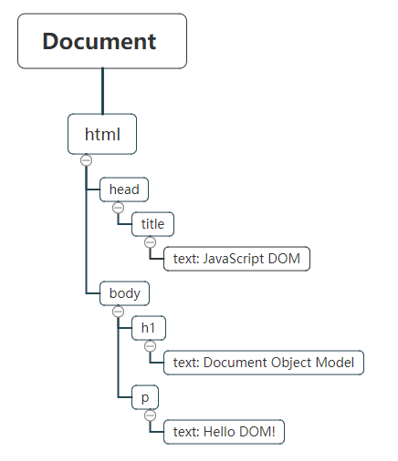
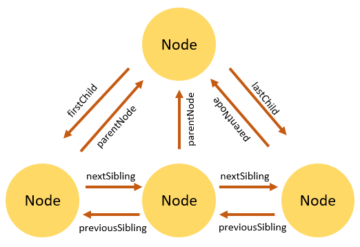
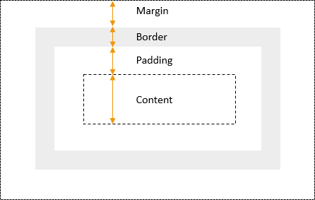
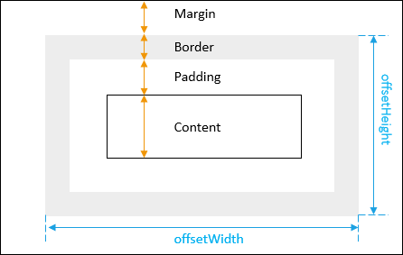
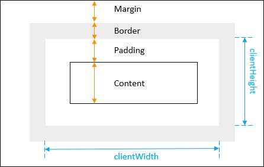

# Document Object Model

## What is Document Object Model (DOM)?

It is an application programming interface (API) for manipulating HTML and XML documents.

It represents a document as a tree of nodes.

It provides API that allows you to add, remove, and modify parts of the document through methods.

## A document as a hierarchy of nodes

The DOM represents an HTML or XML document as a hierarchy of nodes.

```html
<html>
    <head>
        <title>JavaScript DOM</title>
    </head>
    <body>
        <h1>Document Object Model</h1>
        <p>Hello DOM!</p>
    </body>
</html>
```



### Node Types

Each node in the DOM tree is identified by a node type. JavaScript uses integer numbers to determine the node types.

A node is a generic name of any object in the DOM tree. It can be any built-in DOM element such as the document. Or it can be any HTML tag specified in the HTML document like `<div>` or `<p>`. 

An element is a node with a specific node type `Node.ELEMENT_NODE`== 1.  or 

In other words, the node is generic type of the element. The element is a specific type of the node with the node type `Node.ELEMENT_NODE`.

The following table illustrates the node type constants:

| Constant                           | Value | Description                                                  |
| :--------------------------------- | :---- | :----------------------------------------------------------- |
| `Node.ELEMENT_NODE`                | `1`   | An `Element` node like `<p>` or `<div>`.                     |
| `Node.TEXT_NODE`                   | `3`   | The actual `Text` inside an `Element` or `Attr`.             |
| `Node.CDATA_SECTION_NODE`          | `4`   | A `CDATASection`, such as `<!CDATA[[ … ]]>`.                 |
| `Node.PROCESSING_INSTRUCTION_NODE` | `7`   | A `ProcessingInstruction` of an XML document, such as `<?xml-stylesheet … ?>`. |
| `Node.COMMENT_NODE`                | `8`   | A `Comment` node, such as `<!-- … -->`.                      |
| `Node.DOCUMENT_NODE`               | `9`   | A `Document` node.                                           |
| `Node.DOCUMENT_TYPE_NODE`          | `10`  | A `DocumentType` node, such as `<!DOCTYPE html>`.            |
| `Node.DOCUMENT_FRAGMENT_NODE`      | `11`  | A `DocumentFragment` node.                                   |


Any node has relationships to other nodes in the DOM tree. The relationships are the same as the one described in a traditional family tree.

For example, `<body>` is a child node of the `<html>` node, and `<html>` is the parent of the `<body>` node.

The `<body>` node is the sibling of the `<head>` node because they share the same immediate parent, which is the `<html>` element.

- An HTML or XML document can be represented as a tree of nodes, like a traditional family tree.

- Each markup can be represented as a node with a specific node type.

- Element is a specific type of node with the node type `Node.ELEMENT_NODE`.

- In the DOM tree, a node has relationships with other nodes.

  <svg style="display: inline-block; position: absolute; top: 0; left: 0;" viewBox="-50 0 600 70" preserveAspectRatio="xMinYMin meet"><a xlink:href="https://developer.mozilla.org/en-US/docs/Web/API/EventTarget" target="_top"><rect x="1" y="1" width="110" height="50" fill="#fff" stroke="#D4DDE4" stroke-width="2px"></rect><text x="56" y="30" font-size="12px" font-family="Consolas,Monaco,Andale Mono,monospace" fill="#4D4E53" text-anchor="middle" alignment-baseline="middle">EventTarget</text></a><polyline points="111,25  121,20  121,30  111,25" stroke="#D4DDE4" fill="none"></polyline><line x1="121" y1="25" x2="151" y2="25" stroke="#D4DDE4"></line><a xlink:href="https://developer.mozilla.org/en-US/docs/Web/API/Node" target="_top"><rect x="151" y="1" width="75" height="50" fill="#fff" stroke="#D4DDE4" stroke-width="2px"></rect><text x="188.5" y="30" font-size="12px" font-family="Consolas,Monaco,Andale Mono,monospace" fill="#4D4E53" text-anchor="middle" alignment-baseline="middle">Node</text></a><polyline points="226,25  236,20  236,30  226,25" stroke="#D4DDE4" fill="none"></polyline><line x1="236" y1="25" x2="266" y2="25" stroke="#D4DDE4"></line><a xlink:href="https://developer.mozilla.org/en-US/docs/Web/API/Element" target="_top"><rect x="266" y="1" width="75" height="50" fill="#fff" stroke="#D4DDE4" stroke-width="2px"></rect><text x="303.5" y="30" font-size="12px" font-family="Consolas,Monaco,Andale Mono,monospace" fill="#4D4E53" text-anchor="middle" alignment-baseline="middle">Element</text></a><polyline points="341,25  351,20  351,30  341,25" stroke="#D4DDE4" fill="none"></polyline><line x1="351" y1="25" x2="381" y2="25" stroke="#D4DDE4"></line><a xlink:href="https://developer.mozilla.org/en-US/docs/Web/API/HTMLElement" target="_top"><rect x="381" y="1" width="110" height="50" fill="#F4F7F8" stroke="#D4DDE4" stroke-width="2px"></rect><text x="436" y="30" font-size="12px" font-family="Consolas,Monaco,Andale Mono,monospace" fill="#4D4E53" text-anchor="middle" alignment-baseline="middle">HTMLElement</text></a></svg>


## Accessing DOM

We have some methods to access the elements inside html document. These methods belong to Element object of the DOM

- getElement... methods -> these methods belong to document object of the DOM
  - `documentgetElementById()`
  - `getElementsByClassName()`
  - `getElementsByName()`
  - `getElementsByTagName()`
- querySelect... methods -> hese methods belong to Element object of the DOM
  - `querySelector()`
  - `querySelectorAll()`

### Selecting Elements

#### `getElementById()` method

An HTML element often has an `id` attribute like this:

```html
<div id="root"></div>
```

The `id` is used to *uniquely* identify an HTML element within the document. By rules, the id `root` is unique within the document; `no` other elements can have this `root` id.

The `id` is **case-sensitive**. For example, the `'root'` and `'Root'` are totally different id.

  - The `getElementById()` returns a DOM element specified by an `id` or `null` if no matching element found.

  - If multiple elements share the same `id`, even though it is invalid, the `getElementById()` returns the first element it encounters.

    [Example 1](ex1.html)

#### `getElementsByClassName()` method

The `getElementsByClassName()` method returns a live `HTMLCollection` of elements, which is an array-like object.

If you call the `getElementsByClassName()` method on the `document` object, the method searches for elements with the specified class names in the whole document.

However, when you call the `getElementsByClassName()` method on a specific element, it returns only matching elements in the subtree of that element.

[Example 2](ex2.html)

#### `getElementsByName()` method

Every element on an HTML document *may have* a `name` attribute. Unlike the `id` attribute, multiple HTML elements can share the same `value` of the `name` attribute like this:

```html
<input type="radio" name="language" value="JavaScript">
<input type="radio" name="language" value="TypeScript">
```

The `getElementsByName()` accepts a `name` which is the value of the `name` attribute of elements and returns a live `NodeList` of elements.

The return collection of elements is live. It means that the return elements are automatically updated when elements with the same name are [inserted](https://www.javascripttutorial.net/dom/manipulating/insert-an-element-before-an-existing-element/) and/or [removed](https://www.javascripttutorial.net/javascript-dom/javascript-removechild/) from the document.

[Example 3](ex3.html)

#### `getElementsByTagName()` method

- The `getElementsByTagName()` is a method of the document or element object.
- The `getElementsByTagName()` accepts a tag name and returns a list of elements with the matching tag name.
- The `getElementsByTagName()` returns a live `HTMLCollection` of elements. The `HTMLCollection` is an array-like object.

[Example 4](ex4.html)

#### `querySelector()` method

The `querySelector()` is a method of the `Element` interface. The `querySelector()` allows you to find the first element that matches one or more CSS selectors.

You can call the `querySelector()` method on the `document` or any HTML element.

```js
let element = parentNode.querySelector(selector);
```

In this syntax, the `selector` is a CSS selector or a group of CSS selectors to match the descendant elements of the `parentNode`.

If the `selector` is not valid CSS syntax, the method will raise a `SyntaxError` exception.

If no element matches the CSS selectors, the `querySelector()` returns `null`.

#### `querySelectorAll()` method

find all elements that match a CSS selector or a group of CSS selector:

```js
let elementList = parentNode.querySelectorAll(selector);
```

The `querySelectorAll()` method returns a static `NodeList` of elements that match the CSS selector. If no element found, it returns an empty `NodeList`.

Note that the `NodeList` is an array-like object, not an array object. However, in modern web browsers, you can use the `forEach()` method like the one in the array object.

To convert the `NodeList` to an array, you use the `Array.from()` method like this:

```js
let nodeList = Array.from(document.querySelectorAll(selector));
```

[Example 5](ex5.html)

### Traversing Elements




#### Get the Parent Element

```js
let parent = oneNodeInPage.parentNode;
```

#### Getting Siblings

- next

```js
let nextSibling = currentNode.nextElementSibling;
```

- previous

```js
let nextSibling = currentNode.nextElementSibling;
```

[Example 6](ex6.html)

[Example 6a](ex6a.html)

#### Getting Child Elements

- first child

  ```js
  let content = document.getElementById('menu');
  let firstChild = content.firstChild.nodeName;
  console.log(firstChild);
  ```

  The Console window show `#text` because a text node is inserted to maintain the whitespace between the openning `<ul>` and `<li>` tags. This whitespace creates a `#text` node.

  > Note that any whitespace such as a single space, multiple spaces, returns, and tabs will create a `#text` node. To remove the `#text` node, you can remove the whitespaces.

  ```js
  let content = document.getElementById('menu');
  console.log(content.firstElementChild);
  ```

  

- last child

  ```js
  let lastChild = parentElement.lastChild;
  ```

  In case the `parentElement` does not have any child element, the `lastChild` returns `null`. Similar to the the `firstChild` property, the `lastChild` property returns the first element node, text node, or comment node. If you want to select only the last child element with the element node type, you use the `lastElementChild` property:

  ```js
  let menu = document.getElementById('menu');
  console.log(main.lastElementChild);
  ```

- all children

  live `NodeList` of child elements of a specified element, you use the `childNodes` property:

  ```js
  let menu = document.getElementById('menu');
  let children = menu.children;
  console.log(children);
  ```

### Manipulating

#### `createElement()`

How to use the JavaScript `document.createElement()` to create a new HTML element and attach it to the DOM tree.

```js
let div = document.createElement('div');
div.innerHTML = '<p>CreateElement example</p>';
document.body.appendChild(div);
```

#### `appendChild()`

```js
document.body.appendChild(div);
```

#### textContent

 use textContent property

you can assign new values to it

```html
<div id="note">
    JavaScript textContent Demo!
    <span style="display:none">Hidden Text!</span>
    <!-- my comment -->
</div>
```

```js
let note = document.getElementById('note');
console.log(note.textContent);
```

```
JavaScript textContent Demo!
Hidden Text!
```

#### `textContent` vs. `innerText`

On the other hand, the `innerText` takes the CSS style into account and returns only human-readable text. For example:

```js
let note = document.getElementById('note');
console.log(note.innerText);Code language: JavaScript (javascript)
```

Output:

```
JavaScript textContent Demo!
```

Since the `innerText` property uses the up-to-date CSS to compute the text, accessing it will trigger a reflow, which is computationally expensive.

> A **reflow** occurs when a web brower needs to process and draw parts or all of a webpage again.

setting value

```js
let note = document.getElementById('note');
note.textContent = 'This is a note';
```


### Working on attributes

HTML Attributes & DOM Properties

- Get Value of an Attribute`element.getAttribute(name)` 

  The value of an attribute is always a string. However, when the attribute is converted to the property of a DOM object, the property value can be a string, a boolean, an object, etc.

  #### Summary

  - Attributes are specified in HTML elements.
  - Properties are specified DOM objects.
  - Attributes are converted to properties respectively.
  - Use the `element.attributes` property to access standard and custom attributes of an element.
  - Use the `element.dataset` property to access the `data-*` attributes.

- Set Value of an Attribute`element.setAttribute(name, value)` 

  Note that the `disabled` attribute is special because it is a Boolean attribute. If a Boolean attribute is present, whatever value it has, the value is considered to be `true`. To set the value of a Boolean attribute to `false`, you need to remove the entire attribute using the `removeAttribute()` method.

  #### Summary

  - Use the `setAttribute()` to set the value of an attribute on a specified element.
  - Setting the value of a Boolean attribute to whatever value, that value will be considered to be `true`.
  - Get the value of an attribute of a specified element by calling the `getAttribute()` method on the element.
  - The `getAttribute()` returns null if the attribute does not exist.

- Check if an Element has an Attribute: `element.hasAttribute(name)` 

  How it works:

  - Select the button with the id btnSend by using the `querySelector()` method.
  - Check if the button has the disabled attribute by calling the `hasAttribute()` method on the button element.

  #### Summary

  - Use the `hasAttribute()` method to check if an element contains a specified attribute.

- Remove an Attribute from Elements: `element.removeAttribute(name)` 

  #### Summary

  - Use the `removeAttribute()` to remove an attribute from a specified element.
  - Setting the value of a Boolean attribute to `false` will not work; use the `removeAttribute()` method instead.

> # HTML attribute vs. DOM property
>
> \-------------------------------

> ------

> **Attributes are defined by HTML. Properties are defined by the DOM (Document Object Model).**
>
> - A few HTML attributes have 1:1 mapping to properties. `id` is one example.
> - Some HTML attributes don't have corresponding properties. `colspan` is one example.
> - Some DOM properties don't have corresponding attributes. `textContent` is one example.
> - Many HTML attributes appear to map to properties ... but not in the way you might think!
>
> That last category is confusing until you grasp this general rule:
>
> **Attributes \*initialize\* DOM properties and then they are done. Property values can change; attribute values can't.**
>
> For example, when the browser renders `<input type="text" value="Bob">`, it creates a corresponding DOM node with a `value` property initialized to "Bob".
>
> When the user enters "Sally" into the input box, the DOM element `value` *property* becomes "Sally". But the HTML `value` *attribute* remains unchanged as you discover if you ask the input element about that attribute: `input.getAttribute('value')` returns "Bob".
>
> The HTML attribute `value` specifies the *initial* value; the DOM `value` property is the *current* value.

> ------

> The `disabled` attribute is another peculiar example. A button's `disabled` property is `false` by default so the button is enabled. When you add the `disabled` attribute, its presence alone initializes the button's `disabled` property to `true` so the button is disabled.
>
> Adding and removing the `disabled` attribute disables and enables the button. The value of the attribute is irrelevant, which is why you cannot enable a button by writing `<button disabled="false">Still Disabled</button>.`
>
> Setting the button's `disabled` *property* disables or enables the button. The value of the *property* matters.
>
> **The HTML attribute and the DOM property are not the same thing, even when they have the same name.**

> *source: https://stackoverflow.com/a/53924373*

### Styling

- Get or Set Inline Style

  The `style` property returns the inline styles of an element. It is not very useful in practice because the `style` property doesn’t return the rules that come from elsewhere e.g., styles from an external style sheet.

  To get all styles applied to an element, you should use the `window.getComputedStyle()` method.

  #### Summary

  Use the properties of `element.style` object to set the inline CSS properties for the HTML element.

- Get the Computed Style

  #### Summary

  - The `getComputedStyle()` is a method of the `window` object.
  - The `getComputedStyle()` method returns an object that contains the computed style of an element.

- Get CSS Classes

  using `classList()`

- Manipulate CSS Classes

  #### Summary

  - The element’s `classList` property returns the live collection of CSS classes of the element.
  - Use `add()` and `remove()` to add CSS classes to and remove CSS classes from the class list of an element.
  - Use `replace()` method to replace an existing class with a new one.
  - Use `contains()` method to check if the class list of an element contains a specified class.
  - Use the `toggle()` method to toggle a class.

- Get Element’s Width and Height

  how to get the current computed dimension of an element, including width and height.

  ### Setting inline styles

  To set the inline style of an element, you use the `style` property of that element:

  ```
  element.styleCode language: CSS (css)
  ```

  The `style` property returns the read-only `CSSStyleDeclaration` object that contains a list of CSS properties. For example, to set the color of an element to `red`, you use the following code:

  ```
  element.style.color = 'red';Code language: JavaScript (javascript)
  ```

  If the CSS property contains hyphens (`-`) for example `-webkit-text-stroke` you can use the array-like notation (`[]`) to access the property:

  ```
  element.style.['-webkit-text-stock'] = 'unset';Code language: JavaScript (javascript)
  ```

  The following table shows the common CSS properties:

  | **CSS**               | **JavaScript**       |
  | :-------------------- | :------------------- |
  | background            | background           |
  | background-attachment | backgroundAttachment |
  | background-color      | backgroundColor      |
  | background-image      | backgroundImage      |
  | background-position   | backgroundPosition   |
  | background-repeat     | backgroundRepeat     |
  | border                | border               |
  | border-bottom         | borderBottom         |
  | border-bottom-color   | borderBottomColor    |
  | border-bottom-style   | borderBottomStyle    |
  | border-bottom-width   | borderBottomWidth    |
  | border-color          | borderColor          |
  | border-left           | borderLeft           |
  | border-left-color     | borderLeftColor      |
  | border-left-style     | borderLeftStyle      |
  | border-left-width     | borderLeftWidth      |
  | border-right          | borderRight          |
  | border-right-color    | borderRightColor     |
  | border-right-style    | borderRightStyle     |
  | border-right-width    | borderRightWidth     |
  | border-style          | borderStyle          |
  | border-top            | borderTop            |
  | border-top-color      | borderTopColor       |
  | border-top-style      | borderTopStyle       |
  | border-top-width      | borderTopWidth       |
  | border-width          | borderWidth          |
  | clear                 | clear                |
  | clip                  | clip                 |
  | color                 | color                |
  | cursor                | cursor               |
  | display               | display              |
  | filter                | filter               |
  | float                 | cssFloat             |
  | font                  | font                 |
  | font-family           | fontFamily           |
  | font-size             | fontSize             |
  | font-variant          | fontVariant          |
  | font-weight           | fontWeight           |
  | height                | height               |
  | left                  | left                 |
  | letter-spacing        | letterSpacing        |
  | line-height           | lineHeight           |
  | list-style            | listStyle            |
  | list-style-image      | listStyleImage       |
  | list-style-position   | listStylePosition    |
  | list-style-type       | listStyleType        |
  | margin                | margin               |
  | margin-bottom         | marginBottom         |
  | margin-left           | marginLeft           |
  | margin-right          | marginRight          |
  | margin-top            | marginTop            |
  | overflow              | overflow             |
  | padding               | padding              |
  | padding-bottom        | paddingBottom        |
  | padding-left          | paddingLeft          |
  | padding-right         | paddingRight         |
  | padding-top           | paddingTop           |
  | page-break-after      | pageBreakAfter       |
  | page-break-before     | pageBreakBefore      |
  | position              | position             |
  | stroke-dasharray      | strokeDasharray      |
  | stroke-dashoffset     | strokeDashoffset     |
  | stroke-width          | strokeWidth          |
  | text-align            | textAlign            |
  | text-decoration       | textDecoration       |
  | text-indent           | textIndent           |
  | text-transform        | textTransform        |
  | top                   | top                  |
  | vertical-align        | verticalAlign        |
  | visibility            | visibility           |
  | width                 | width                |
  | z-index               | zIndex               |

  To completely override the existing inline style, you set the `cssText` property of the `style` object. For example:

  ```js
  element.style.cssText = 'color:red;backgroundColor:yellow';
  ```

  Or you can use the `setAttribute()` method:

  ```js
  element.setAttribute('style','color:red;background-color:yellow');
  ```

  Once setting the inline style, you can modify one or more CSS properties:

  ```js
  element.style.color = 'blue';
  ```

  If you do not want to completely overwrite the existing CSS properties, you can concatenate new CSS property to the `cssText` as follows:

  ```js
  element.style.cssText += 'color:red;backgroundColor:yellow';
  ```

  In this case, the `+= `operator appends the new style string to the existing one.

  The following `css()` helper function is used to set multiple styles for an element from an object of key-value pairs:

  ```js
  function css(e, styles) {
      for (const property in styles)
          e.style[property] = styles[property];
  }
  ```

  You can use this `css()` function to set multiple styles for an element with the id `#content` as follows:

  ```js
  let content = document.querySelector('#content');
  css(content, { background: 'yellow', border: 'solid 1px red'});
  ```

### getComputedStyle()

The `getComputedStyle()` is a method of the `window` object, which returns an object that contains the computed style an element:

```
let style = window.getComputedStyle(element [,pseudoElement]);
Code language: JavaScript (javascript)
```

The `getComputedStyle()` method accepts two arguments:

- `element` is the element that you want to return the computed styles. If you pass another node type e.g., Text node, the method will throw an error.
- `pseudoElement` specifies the pseudo-element to match. It defaults to `null`.

For example, if you want to get the computed value of all the CSS properties of a link with the hover state, you pass the following arguments to the `getComputedStyle()` method:

```js
let link = document.querySelector('a');
let style = getComputedStyle(link,':hover');
console.log(style);
```


Let’s take some examples of manipulating CSS classes of the element via the `classList`‘s interface.

#### 1) Get the CSS classes of an element

Suppose that you have a `div` element with two classes: `main` and `red`.

```html
<div id="content" class="main red">JavaScript classList</div>   
```

The following code displays the class list of the `div` element in the Console window:

```js
let div = document.querySelector('#content');
for (let cssClass of div.classList) {
    console.log(cssClass);
}
```

Output:

```
main
red
```

How it works:

- First, select the `div` element with the id `content` using the `querySelector()` method.
- Then, iterate over the elements of the `classList` and show the classes in the Console window.

#### 2) Add one or more classes to the class list of an element

To add one or more CSS classes to the class list of an element, you use the `add()` method of the `classList`.

For example, the following code adds the `info` class to the class list of the `div` element with the id `content`:

```js
let div = document.querySelector('#content');
div.classList.add('info');
```

The following example adds multiple CSS classes to the class list of an element:

```js
let div = document.querySelector('#content');
div.classList.add('info','visible','block');
```

#### 3) Remove element’s classes

To remove a CSS class from the class list of an element, you use the `remove()` method:

```js
let div = document.querySelector('#content');
div.classList.remove('visible');
```

Like the `add()` method, you can remove multiple classes once:

```js
let div = document.querySelector('#content');
div.classList.remove('block','red');
```

#### 4) Replace a class of an element

To replace an existing CSS class with a new one, you use the `replace()` method:

```js
let div = document.querySelector('#content');
div.classList.replace('info','warning');
```

#### 5) Check if an element has a specified class

To check if the element has a specified class, you use the `contains()` method:

```js
let div = document.querySelector('#content');
div.classList.contains('warning'); // true
```

The `contains()` method returns `true` if the `classList` contains a specified class; otherwise `false`.

#### 6) Toggle a class

If the class list of an element contains a specified class name, the toggle() method removes it. If the class list doesn’t contain the class name, the toggle() method adds it to the class list.

The following example uses the `toggle()` method to toggle the `visible` class of an element with the id `content`:

```js
let div = document.querySelector('#content');
div.classList.toggle('visible');
```

### width and height of a block element

The following picture displays the CSS box model that includes a block element with content, padding, border, and margin:



To get the element’s width and height that include padding and border, you use the `offsetWidth` and `offsetHeight` properties of the element:

```
let box = document.querySelector('div');
let width = box.offsetWidth;
let height = box.offsetHeight;
Code language: JavaScript (javascript)
```

The following picture illustrates the offsetWidth and offsetHeight of an element:



To get the element’s width and height that include padding but without the border, you use the `clientWidth` and `clientHeight` properties:

```
let box = document.querySelector('div');
let width = box.clientWidth;
let height = box.clientHeight;
Code language: JavaScript (javascript)
```

The following picture illustrates the `clientWidth` and `clientHeight` of an element:



To get the margin of an element, you use the `getComputedStyle()` method:

```js
let box = document.querySelector('div');
let style = getComputedStyle(box);

let marginLeft = parseInt(style.marginLeft);
let marginRight = parseInt(style.marginRight);
let marginTop = parseInt(style.marginTop);
let marginBottom = parseInt(style.marginBottom);
```

To get the border width of an element, you use the property of the `style` object returned by the `getComputedStyle()` method:

```js
let box = document.querySelector('div');
let style = getComputedStyle(box);

let borderTopWidth = parseInt(style.borderTopWidth) || 0;
let borderLeftWidth = parseInt(style.borderLeftWidth) || 0;
let borderBottomWidth = parseInt(style.borderBottomWidth) || 0;
let borderRightWidth = parseInt(style.borderRightWidth) || 0;
```

To get the height and width of the window, you use the following code:

```js
let width = window.innerWidth || document.documentElement.clientWidth || document.body.clientWidth;
let height = window.innerHeight || document.documentElement.clientHeight || document.body.clientHeight;
```

> *source: https://www.javascripttutorial.*
>
> *net/javascript-dom/document-object-model-in-javascript/*